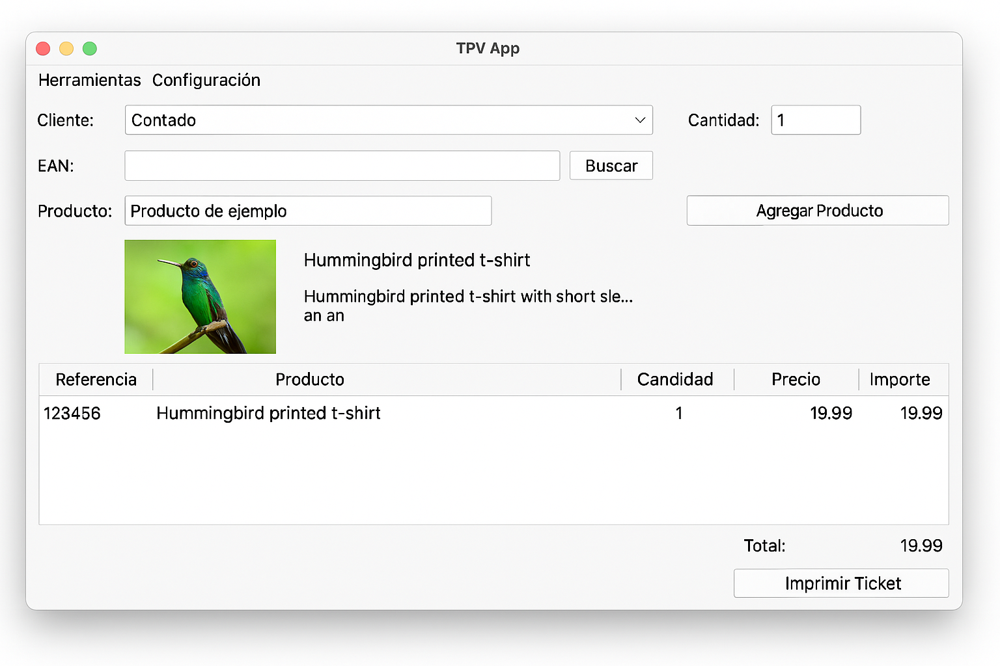
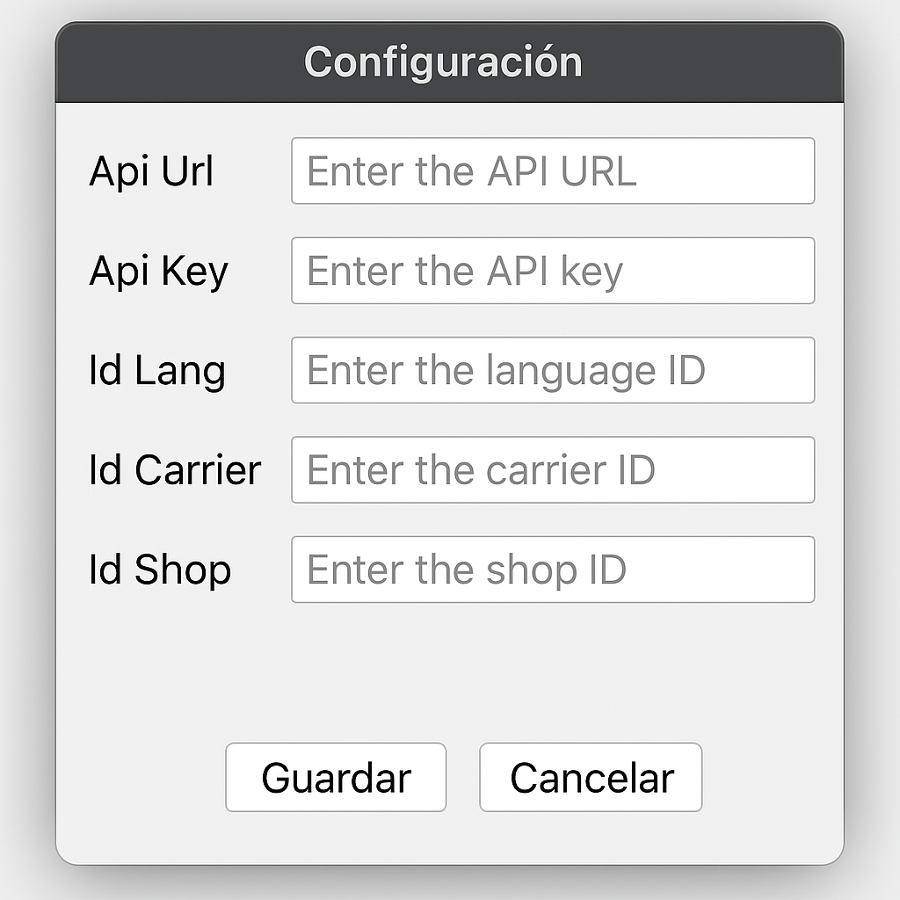

# PrestaGestion
Aplicación de escritorio para generación de tickets de venta y sincronización con PrestaShop a través de su Webservice API. Desarrollada en Python con interfaz gráfica (tkinter) y base de datos local (SQLite).

📦 Funcionalidades

🎟️ Facturación
Crear y generar tickets de venta

Ventana emergente para previsualizar ticket antes de confirmar

Botones:

Cobrar: guarda el ticket en base de datos y sincroniza con PrestaShop

Cancelar: cierra la ventana sin guardar

Limpieza automática de campos tras cada venta

🛒 Conexión con PrestaShop
La aplicación se conecta con el Webservice de PrestaShop para:

🔄 Sincronizar Clientes: Descarga o actualiza información de clientes en local

📦 Actualizar Stocks: Disminuye el stock en base a los productos vendidos

📑 Crear Pedidos: Registra automáticamente el pedido en la tienda online

🧾 Asociar tickets con el ID del pedido generado

🌐 La conexión se configura desde el menú de parámetros

⚙️ Parámetros configurables
Accesible desde el submenú Parámetros, permite modificar y guardar:

Api Url (URL del Webservice de PrestaShop)

Api Key (Clave de acceso al Webservice)

Id Lang (ID de idioma por defecto)

Id Carrier (Transportista por defecto)

Id Shop (ID de la tienda)

Los parámetros se guardan de forma persistente en config.ini y se cargan automáticamente al iniciar la app.

🗃️ Base de Datos
Tabla principal: tickets

sql
Copiar
Editar
CREATE TABLE tickets (
    id INTEGER PRIMARY KEY,
    id_customer INTEGER,
    payment TEXT,
    products TEXT,  -- Formato JSON: {"id_product": ["1","2"], "quantity": ["3","1"]}
    total_paid REAL,
    date_add DATETIME
);

📁 Estructura de Archivos
bash
Copiar
Editar
app.py               # Aplicación principal
config_window.py     # Ventana para configurar parámetros
prestashop_api.py    # Funciones para conexión con la API de PrestaShop
config.ini           # Fichero de configuración
tickets.db           # Base de datos local SQLite
README.md            # Este archivo
🛠️ Requisitos
Python 3.8 o superior

Módulos: tkinter, sqlite3, configparser, requests (para la conexión API PrestaShop)

Instalación de dependencias:
bash
Copiar
Editar
pip install requests

🚀 Ejecución
Compilación en Ejecutable (opcional)
Si deseas compilar la app como un ejecutable para distribución:

Windows
bash
Copiar
Editar
pip install pyinstaller
pyinstaller --onefile --windowed main.py

macOS
bash
Copiar
Editar
pip3 install pyinstaller
pyinstaller --onefile --windowed main.py

📌 Notas Adicionales
Asegúrate de que la URL del Webservice de PrestaShop sea accesible y tenga permisos configurados.

La clave API debe tener acceso a recursos como customers, orders, stocks, etc.

Puedes extender el sistema para incluir más sincronizaciones como productos, categorías, transportistas, etc.
